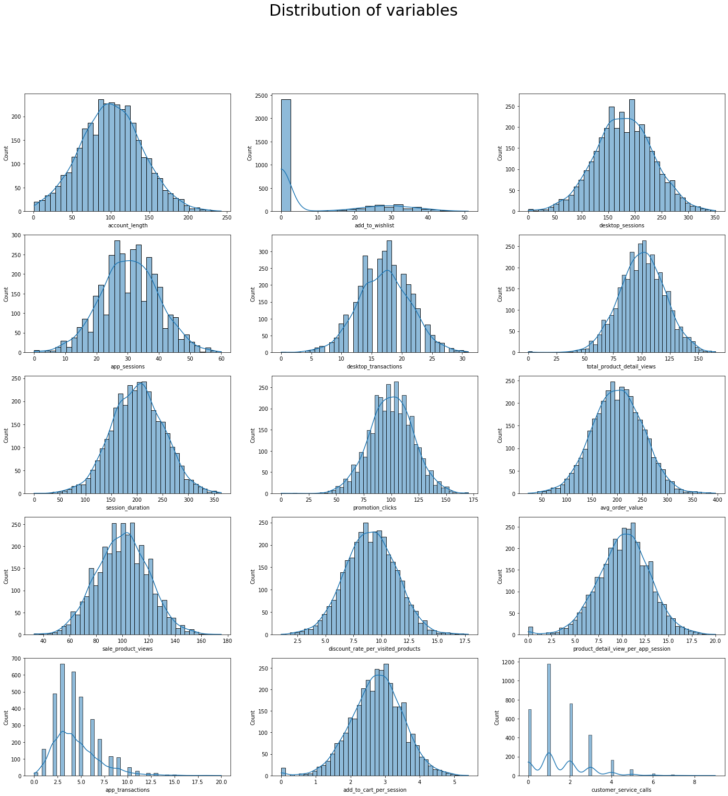

# 📊 Churn Prediction Using Machine Learning

## 🧩 Table of Contents
- [Problem Statement](#problem-statement)  
- [Project Objective](#project-objective)  
- [Approach](#approach)  
- [Visualizations](#visualizations)
- [Models Used](#models-used)  
- [Key Results](#key-results)  
- [Data Dictionary](#data-dictionary)  
- [Technologies Used](#technologies-used)

---

## 📌 Problem Statement

Customer churn significantly affects business revenue and growth. Predicting churn helps companies retain valuable users through targeted strategies. This project focuses on predicting customer churn based on user behavior and transaction patterns.

---

## 🎯 Project Objective

To build a machine learning model that accurately predicts whether a customer is likely to churn using historical user data.

---

## 🔍 Approach

1. **Data Cleaning & Preprocessing**  
   - Handled missing values  
   - Encoded categorical variables (binary + one-hot encoding)  
   - Scaled numerical features using MinMaxScaler  

2. **Exploratory Data Analysis (EDA)**  
   - Checked churn distribution  
   - Analyzed feature correlations  
   - Visualized key user behaviors  

3. **Model Building & Evaluation**  
   - Built models: Logistic Regression, KNN, and Gradient Boosting  
   - Evaluated using accuracy, F1 score, and confusion matrix  
   - Tuned hyperparameters using GridSearchCV  

---

## 📊 Visualizations

### 🔸 Correlation Matrix
Exploring relationships between numerical features.

---

### 🔸 Feature Distributions
Visualizing the distribution of key numeric features after preprocessing.

---

### 🔸 Confusion Matrix – Gradient Boosting
Best-performing model’s confusion matrix on the test set.

---

### 🔸 KNN Elbow Curve
Used to select the optimal `k` value for KNN.

---

## 🤖 Models Used

- **Logistic Regression (with L1 and L2 regularization)**  
- **K-Nearest Neighbors (tuned with elbow method)**  
- **Gradient Boosting Classifier (tuned via Grid Search)**

---

## ✅ Key Results

- **Gradient Boosting** achieved the best performance overall  
- Performance metrics include:  
  - **Accuracy**: ~87–88%  
  - **F1 Score**: Balanced across classes  
  - **Improved recall for churn class** through model tuning  

---

## 📘 Data Dictionary

| Feature | Description |
|---------|-------------|
| `user_id` | Unique customer ID (excluded from training) |
| `account length` | Customer tenure |
| `location code` | Region the user belongs to (one-hot encoded) |
| `credit card info` | Whether the user has saved card info |
| `save push status` | Push notification enabled |
| `add to wishlist` | Wishlist activity count |
| `desktop/app sessions & transactions` | Engagement across platforms |
| `promotion clicks`, `product views`, `AOV` | Browsing and purchase behavior |
| `churn` | Target variable (1 = churned, 0 = retained) |

---

## 🛠️ Technologies Used

- **Python**  
- **Pandas**, **NumPy** – data processing  
- **Seaborn**, **Matplotlib** – visualization  
- **Scikit-learn** – modeling, evaluation, and hyperparameter tuning  
